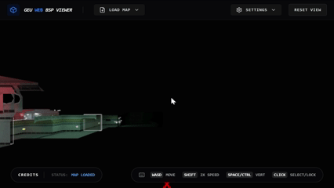

# GoldSrc BSP Viewer 🎮

[](https://opensource.org/licenses/MIT)
[](https://github.com/urgorri/goldsrc-bsp-viewer/releases)

A high-performance, web-based GoldSrc (Half-Life) BSP map viewer built with **React 18**, **Three.js**, **Vite**, and **Tailwind CSS**.

---

### 🎥 Demo





---

## ✨ Features

- **🚀 BSP v30 Parsing**: Robust parsing of GoldSrc map files.
- **🖼️ WAD3 Support**: Dynamic loading of external textures from multiple `.wad` files.
- **💡 Advanced Lightmapping**: High-quality lighting using atlas-based lightmaps with overbrightening and gamma correction.
- **🔍 Entity Inspector**: Interactive selection and inspection of entity key-value pairs.
- **🔗 Entity Connections**: Visualize `target` and `targetname` relationships with color-coded lines.
- **🏗️ FGD Integration**: Support for FGD files to provide meaningful metadata for map entities.
- **🕹️ FPS Controls**: Smooth noclip movement with acceleration and friction.
- **🛠️ Customization**: Toggleable wireframes, axes, transparency for triggers, and configurable texture filtering.

## 🚀 Getting Started

### Prerequisites

- [Node.js](https://nodejs.org/) (v18 or newer)
- npm, yarn, or pnpm

### Installation

1. **Clone the repository:**
   ```bash
   git clone https://github.com/urgorri/goldsrc-bsp-viewer.git
   cd goldsrc-bsp-viewer
   ```

2. **Install dependencies:**
   ```bash
   npm install
   ```

3. **Start the development server:**
   ```bash
   npm run dev
   ```

4. **Build for production:**
   ```bash
   npm run build
   ```

## 📖 Usage

### Loading a Map

1. Open the application in your browser.
2. Click the **File Icon** in the top-left menu.
3. **Important**: Select all necessary files at once in the file picker:
   - One `.bsp` file (Required).
   - Relevant `.wad` files for textures (Recommended).
   - An `.fgd` file for better entity names (Optional).
4. Wait for the status bar to indicate "Ready".

### Controls

| Action | Control |
| :--- | :--- |
| **Move** | `W` `A` `S` `D` |
| **Up / Down** | `Space` / `Left Ctrl` |
| **Sprint** | Hold `Shift` |
| **Look Around** | `Mouse` (Click to lock) |
| **Select Entity** | `Left Click` (While locked) |
| **Unlock Mouse** | `Esc` |

## 🛠️ Tech Stack

- **Framework**: [React 18](https://reactjs.org/)
- **3D Engine**: [Three.js](https://threejs.org/)
- **Build Tool**: [Vite](https://vitejs.dev/)
- **Styling**: [Tailwind CSS 4](https://tailwindcss.com/)
- **Icons**: [Lucide React](https://lucide.dev/)

## 🤝 Contributing

Contributions are welcome! Please see [CONTRIBUTING.md](CONTRIBUTING.md) for guidelines.

## 📄 License

This project is licensed under the MIT License - see the [LICENSE](LICENSE) file for details.

## 👤 Author

**Gastón Urgorri**
- GitHub: [@urgorri](https://github.com/urgorri)
- Email: [urgorrigaston@gmail.com](mailto:urgorrigaston@gmail.com)

---
*Developed with ❤️ for the GoldSrc modding community.*
