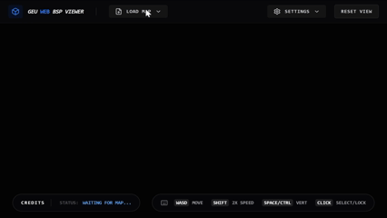

# GoldSrc BSP Viewer 🎮

[](https://opensource.org/licenses/MIT)
[](https://github.com/urgorri/goldsrc-bsp-viewer/releases)

A high-performance, framework-agnostic GoldSrc (Half-Life) BSP map viewer library built with **Three.js**. It also includes an optional **React** wrapper for easy integration.

---

### 🎥 Demo



---

## 🚀 Quick Start (Vanilla JS)

Install the library via npm:

```bash
npm install goldsrc-bsp-viewer
```

Integrate it into any DOM container:

```javascript
import { BspViewer } from 'goldsrc-bsp-viewer';

const viewer = new BspViewer({
  container: document.getElementById('viewer-root'),
  antialias: true
});

// Load a map (buffers can be obtained via fetch, file inputs, etc.)
await viewer.loadMap(bspArrayBuffer, [wadArrayBuffer1, wadArrayBuffer2]);
```

---

## ⚛️ React Usage

The library includes a `ViewerCanvas` component for React applications.

```tsx
import { ViewerCanvas } from 'goldsrc-bsp-viewer';

function App() {
  return (
    <div style={{ width: '100vw', height: '100vh' }}>
      <ViewerCanvas
        pvsEnabled={true}
        showPointEntities={true}
        // ... other options
        onProgress={(percent, message) => console.log(`${message}: ${percent}%`)}
      />
    </div>
  );
}
```

---

## ✨ Features

- **🚀 BSP v30 Parsing**: Robust parsing of GoldSrc map files.
- **🖼️ WAD3 Support**: Dynamic loading of external textures from multiple `.wad` files.
- **💡 Advanced Lightmapping**: High-quality lighting using atlas-based lightmaps with overbrightening and gamma correction.
- **🔍 Entity Inspector**: Interactive selection and inspection of entity key-value pairs.
- **🔗 Entity Connections**: Visualize `target` and `targetname` relationships.
- **🏗️ FGD Integration**: Support for FGD files for meaningful entity metadata.
- **🕹️ FPS Controls**: Smooth noclip movement with acceleration and friction.
- **🛠️ Customization**: Toggleable wireframes, axes, transparency, and texture filtering.

---

## 📖 Detailed Usage

### Initializing the Viewer

The `BspViewer` constructor accepts an options object:

```typescript
const viewer = new BspViewer({
    container: HTMLElement,      // Required
    backgroundColor: number,     // Default: 0x050505
    antialias: boolean,          // Default: true
    showAxes: boolean,           // Default: true

    // Callbacks
    onProgress: (percent, msg) => { ... },
    onEntitySelect: (entity) => { ... },
    onLockChange: (locked) => { ... },

    // Rendering Options
    pvsEnabled: boolean,
    textureFiltering: boolean,
    lightmapFiltering: boolean,
    // ... and more
});
```

### Loading Files

You need to provide the files as `ArrayBuffer`. Here is a common pattern using `fetch`:

```javascript
async function loadMap(mapName) {
    const bspResponse = await fetch(`/maps/${mapName}.bsp`);
    const bspBuffer = await bspResponse.arrayBuffer();

    const wadResponse = await fetch(`/textures/halflife.wad`);
    const wadBuffer = await wadResponse.arrayBuffer();

    await viewer.loadMap(bspBuffer, [wadBuffer]);
}
```

### Event Handling

```javascript
viewer.addEventListener('progress', ({ percent, message }) => {
    console.log(`Loading: ${percent}% - ${message}`);
});

viewer.addEventListener('entitySelect', (entity) => {
    if (entity) console.log('Selected entity class:', entity.classname);
});
```

---

## 🕹️ Controls

| Action | Control |
| :--- | :--- |
| **Move** | `W` `A` `S` `D` |
| **Up / Down** | `Space` / `Left Ctrl` |
| **Sprint** | Hold `Shift` |
| **Look Around** | `Mouse` (Click to lock) |
| **Select Entity** | `Left Click` (While locked) |
| **Unlock Mouse** | `Esc` |

---

## 🤝 Contributing

Contributions are welcome! Please see [CONTRIBUTING.md](CONTRIBUTING.md) for guidelines.

## 📄 License

This project is licensed under the MIT License - see the [LICENSE](LICENSE) file for details.

## 👤 Author

**Gastón Urgorri**
- GitHub: [@urgorri](https://github.com/urgorri)
- Email: [urgorrigaston@gmail.com](mailto:urgorrigaston@gmail.com)

---
*Developed with ❤️ for the GoldSrc modding community.*
